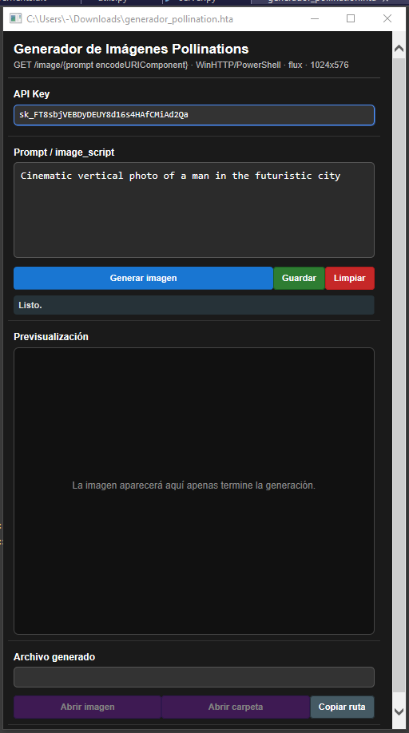

# Mi Primera App Pollinations AI - HTA

Aplicación de escritorio para Windows 10 creada con **HTA**, **HTML**, **CSS** y **JavaScript**, que permite generar imágenes usando el endpoint de **Pollinations AI**.

La app permite escribir un prompt, generar una imagen vertical, previsualizarla automáticamente cuando termina la generación y configurar la API Key desde un input dentro de la aplicación.

---

## Vista previa de la aplicación


También puedes usar esta versión más corta para la imagen si prefieres ruta relativa dentro del repo:

```markdown

```

---

## Características

- Generación de imágenes desde un prompt personalizado.
- Uso del modelo `flux` de Pollinations AI.
- Resolución configurada en `1024x576`.
- Previsualización automática cuando termina la generación.
- Campo editable para la API Key.
- API Key por defecto incluida.
- Botón para guardar el estado actual.
- Botón para limpiar los datos.
- Diseño oscuro compacto.
- Compatible con Windows 10 mediante archivos `.hta`.
- Un solo scroll vertical cuando el contenido lo requiere.

---

## Endpoint utilizado

La app genera imágenes usando el siguiente endpoint:

```text
https://gen.pollinations.ai/image/{PROMPT_ENCODED}?model=flux&height=1024&width=576&nologo=true&key={API_KEY}
```

Donde:

- `{PROMPT_ENCODED}` es el prompt escrito por el usuario codificado con `encodeURIComponent`.
- `{API_KEY}` es la clave configurada en el input de la aplicación.

---

## Cómo usar la aplicación

### 1. Descarga o clona este repositorio

```bash
git clone https://github.com/ErikRojasT/MiPrimeraAppPollinationsAI.git
```

### 2. Abre el archivo `.hta` en Windows

Puedes hacerlo con doble clic sobre el archivo:

```text
generador_pollinations.hta
```

### 3. Escribe tu prompt

Escribe tu prompt en el campo **Prompt / image script**.

Ejemplo:

```text
Cinematic vertical photo of a man in the futuristic city
```

### 4. Verifica la API Key

Verifica o modifica la **API Key** si es necesario.

### 5. Genera la imagen

Presiona el botón **Generar imagen**.

### 6. Espera el resultado

Espera a que termine el proceso.

Cuando la imagen se genere correctamente, aparecerá automáticamente en la sección **Previsualización**.

---

## Requisitos

- Windows 10.
- Conexión a internet.
- Soporte para HTA habilitado.
- Acceso al endpoint de Pollinations AI.
- Una API Key válida.

---

## Posibles problemas

### Error: Permiso denegado

Si aparece un error de permisos al ejecutar el HTA, prueba lo siguiente:

1. Clic derecho sobre el archivo `.hta`.
2. Selecciona **Propiedades**.
3. Si aparece la opción **Desbloquear**, márcala.
4. Haz clic en **Aplicar**.
5. Ejecuta nuevamente la app.

La app usa `WinHttp.WinHttpRequest.5.1` para evitar problemas comunes con `MSXML2.XMLHTTP` en HTA.

---

## Nota sobre seguridad

La API Key está dentro de la aplicación y puede verse en el código fuente del archivo `.hta`.

Esta app está pensada para uso personal o local. No se recomienda distribuir públicamente una versión que incluya una API Key privada.

---

## Tecnologías utilizadas

- HTA
- HTML
- CSS
- JavaScript
- ActiveX
- WinHttpRequest
- ADODB.Stream
- Pollinations AI

---

## Autor

Desarrollado por Erik Rojas T.
